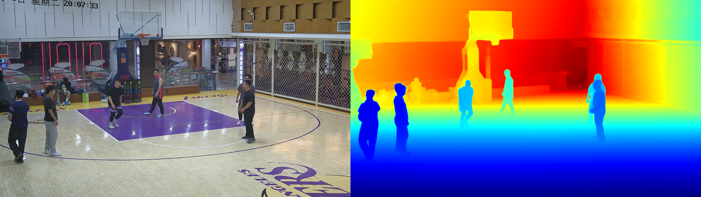
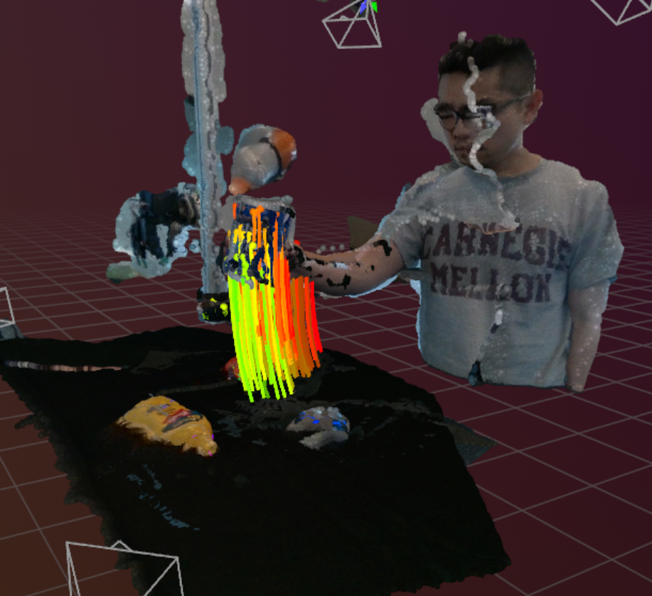
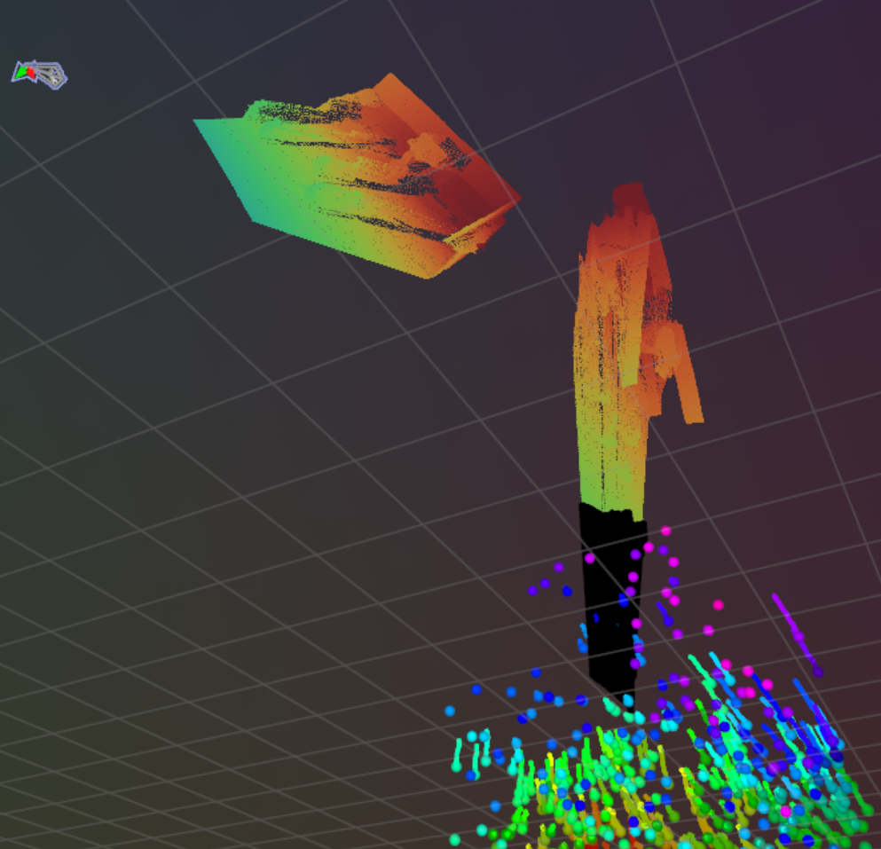
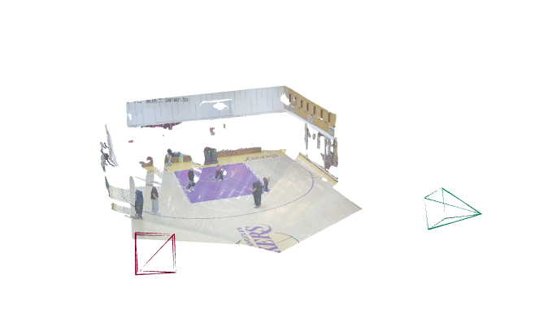

## mvtrcker

一直在跑mvtracker，意外地难跑，现在只有初步的结果，但还没调完

> 首款数据驱动的多视图 3D 点跟踪器 MVTracker，专门用于在动态场景中借助多个相机视图跟踪任意 3D 点。与单目跟踪器易受深度模糊和遮挡影响、传统多相机方法需 20 台以上相机且要繁琐的逐序列优化不同，MVTracker 仅需 4 台左右的实用相机数量，就能通过前馈模型直接预测 3D 对应关系，实现稳健且精准的在线跟踪。其核心创新在于构建了动态融合 3D 特征点云，该点云整合了多视图的深度图和特征信息，既避免了三平面表示带来的信息损失，又能适配不同数量的相机和场景规模。

1. 使用MoGe得到的深度图

2. mvtracker demo.py 效果

- 四个相机

- panoptic__basketball

3. 从hf上找到的进一步demo

panoptic__basketball.rrd

视频位于文件夹内

4. 目前跑的效果

一堆莫名其妙的东西 聚在一起的点是query_points，我还没搞懂这个的逻辑，理应来说应该会记录查询点的运动，然后场景也应该是和demo一样是个完整的scene

然后放大左上的一片之后

所以其实两个视角确实是重建出来了，但是并没有在一起形成完整场景，query_points的位置也有些错位，感觉可能是相机范围和参数没设置对，之后调整也朝这个方向

比较好衔接的就是，项目本身是用query_points查询，然后一直追踪那个点的运动，可以和yolo的识别框衔接

## vggt

问学长之后了解到vggt 重建效果很好

学长当时跑的demo：

